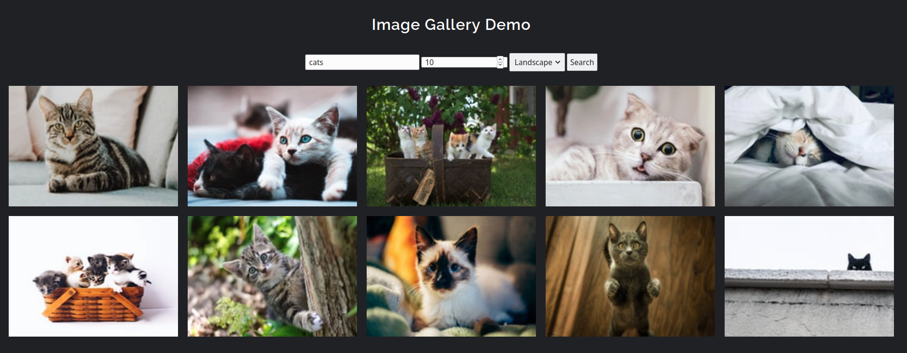
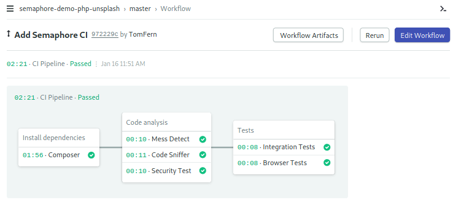
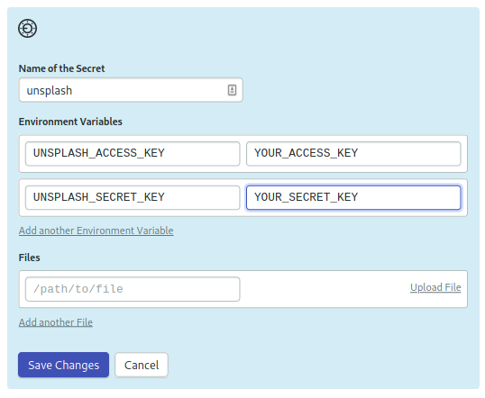

<p align="right"></p>

# Unsplash Image Gallery Demo

This is a PHP Laravel image gallery demo that pulls images from the [Unsplash PHP API](https://github.com/unsplash/unsplash-php).

## Prerequisites

Obtain a API Key from Unsplash:

- Sign up to [Unsplash](https://unsplash.com)
- Go to [Applications](https://unsplash.com/oauth/applications)
- Create a **New Application**.
- Accept the Terms.
- Set a name for the application and copy the **Access Key** and the **Secret Key**.

## Development Setup

- Fork the repository and clone it.
- Install php and composer.
- Install dependencies:

```
$ cd src
$ composer install
```

## Running Locally

- Create an env file for your Unsplash API:

```
$ cp .env.example.unsplash .env-unsplash
```

- Edit the environment file and fill in your **Access Key** and **Secret Keys** obtained from your Unsplash account.
- Prepare the environment:

```
$ export APP_ENV=development
$ source .env-unsplash
$ cp .env.example .env
$ php artisan key:generate
```

- Start the development server on [http://127.0.0.1:8000](http://127.0.0.1:8000):

```
$ php artisan serve
```



## CI Pipeline

We have a CI pipeline that:

- Install dependencies.
- Runs code analisys tests.
- Runs integration and browser tests.



To run the CI Pipeline:

- Sign up to [Semaphore](https://semaphoreci.com)
- Add the project to Semaphore.
- Add a secret called “unsplash” in Semaphore with the following variables:
  - UNSPLASH_ACCESS_KEY = YOUR_UNSPLASH_ACCESS_ID
  - UNSPLASH_SECRET_KEY = YOUR_UNSPLASH_SECRET_KEY

- Make a commit, the CI pipeline should start automatically


## License

The project is open-sourced software licensed under the [MIT license](https://opensource.org/licenses/MIT).
